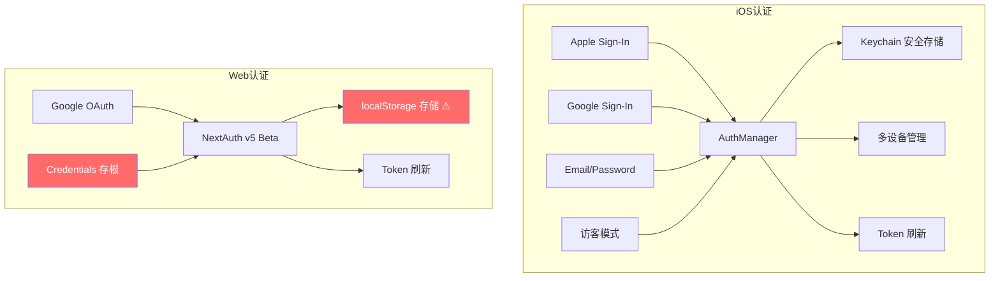
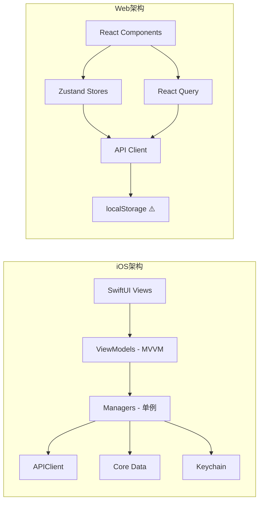
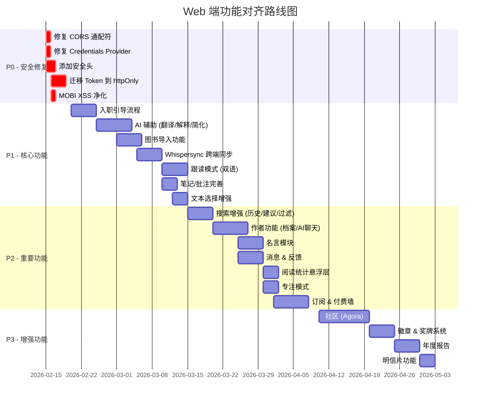
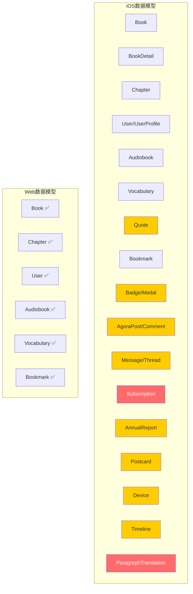

# Readmigo iOS vs Web 功能对比文档

**日期:** 2026-02-14
**目的:** 梳理 iOS 与 Web 平台功能差异，指导 Web 端功能对齐

---

## 总览

| 维度 | iOS | Web |
|------|-----|-----|
| 功能模块数 | 32+ | ~12 |
| 页面/视图数 | 50+ | ~15 |
| 功能完成度 | 生产级 | 原型级 |
| API 集成数 | 25+ 类别 | ~8 类别 |

---

## 功能矩阵

### 核心阅读功能

| 功能 | iOS | Web | 优先级 | 备注 |
|------|:---:|:---:|:------:|------|
| EPUB 阅读器 | ✅ 完整 | ✅ 基础 | - | Web 端基于 epub.js |
| PDF 阅读器 | ✅ PDFKit | ✅ react-pdf | - | |
| MOBI 阅读器 | ✅ 完整 | ✅ 基础 | P1 | Web 端缺少 HTML 净化 |
| TXT 阅读器 | ✅ 完整 | ✅ 基础 | - | |
| 翻页模式 (滚动/分页) | ✅ | ✅ | - | |
| 3D 翻页动画 | ✅ 物理模拟 | ❌ | P3 | iOS 特有体验 |
| 文本选择 + 上下文菜单 | ✅ | ⚠️ 部分 | P1 | Web 端有限 |
| 高亮标注 (多色) | ✅ | ✅ 基础 | P2 | Web 缺少多色选择 |
| 书签 | ✅ | ✅ | - | |
| 笔记/批注 | ✅ | ⚠️ 存根 | P1 | Web 端 UI 存在但功能不完整 |
| 章节导航 | ✅ | ✅ | - | |
| 阅读进度追踪 | ✅ | ✅ | - | |
| 自动翻页 | ✅ | ❌ | P3 | |
| 专注模式 (聚光灯/段落/尺规) | ✅ | ❌ | P2 | Web 端可用 CSS 实现 |
| 故事时间线可视化 | ✅ | ❌ | P3 | |
| 字符图谱 (东亚字符) | ✅ | ❌ | P3 | |
| 图片查看器 (全屏/可滑动) | ✅ | ❌ | P2 | |
| 阅读统计悬浮层 (WPM/时长) | ✅ | ❌ | P2 | |

### 阅读器设置

| 功能 | iOS | Web | 优先级 |
|------|:---:|:---:|:------:|
| 字体选择 (6+ 种) | ✅ | ⚠️ 有限 | P2 |
| 字体大小调节 | ✅ | ✅ | - |
| 行距/字距/字间距 | ✅ | ⚠️ 部分 | P2 |
| 文本对齐方式 | ✅ | ❌ | P3 |
| 段落间距 | ✅ | ❌ | P3 |
| 字重调节 | ✅ | ❌ | P3 |
| 连字符控制 | ✅ | ❌ | P3 |
| 主题 (浅色/深色/护眼) | ✅ | ✅ | - |
| 自定义字体导入 | ✅ | ❌ | P3 |

### AI 辅助功能

| 功能 | iOS | Web | 优先级 |
|------|:---:|:---:|:------:|
| 逐段翻译 | ✅ | ❌ | P1 |
| AI 文本解释 | ✅ | ❌ | P1 |
| AI 文本简化 | ✅ | ❌ | P1 |
| AI 翻译助手 | ✅ | ❌ | P1 |
| 单词查询弹窗 | ✅ | ✅ | - |

### 书城 & 发现

| 功能 | iOS | Web | 优先级 |
|------|:---:|:---:|:------:|
| 英雄轮播图 | ✅ 自动旋转 | ✅ | - |
| 分类菜单 (横向滚动+图标) | ✅ | ✅ | - |
| 推荐书单 (多布局) | ✅ | ✅ | - |
| 分页/无限滚动 | ✅ | ✅ | - |
| 书单风格分发 (排名/编辑推荐/AI推荐等) | ✅ 9种 | ⚠️ 基础 | P2 |
| 搜索功能 | ✅ 统一搜索 | ✅ 基础 | P2 |
| 搜索历史管理 | ✅ | ❌ | P2 |
| 热门搜索/趋势 | ✅ | ❌ | P3 |
| 搜索建议 (自动补全) | ✅ | ❌ | P2 |
| 高级搜索过滤 | ✅ | ❌ | P2 |
| 难度过滤 (简/中/难/高) | ✅ | ❌ | P2 |
| 分类级联选择器 | ✅ | ❌ | P2 |
| 收藏切换 (心形按钮) | ✅ | ✅ | - |
| 下拉刷新 | ✅ | ❌ | P3 |

### 书架 & 图书管理

| 功能 | iOS | Web | 优先级 |
|------|:---:|:---:|:------:|
| 正在阅读 (本地+云端合并) | ✅ | ✅ 基础 | P1 |
| 最近浏览 (横向+网格) | ✅ | ✅ | - |
| 收藏图书 (3列网格/可编辑) | ✅ | ✅ 基础 | P2 |
| 阅读历史管理 (批量删除/重排) | ✅ | ❌ | P2 |
| 访客模式 | ✅ | ❌ | P2 |
| 图书导入 (EPUB/PDF/TXT/MOBI) | ✅ | ❌ | P1 |
| 导入配额追踪 | ✅ | ❌ | P2 |

### 有声书

| 功能 | iOS | Web | 优先级 |
|------|:---:|:---:|:------:|
| 有声书浏览 (带过滤) | ✅ | ✅ 基础 | - |
| 语言选择器 | ✅ | ❌ | P2 |
| 最近收听 | ✅ | ❌ | P2 |
| 播放器 (播放/暂停/跳转) | ✅ | ✅ 基础 | - |
| 章节导航 | ✅ | ✅ | - |
| 播放速度调节 | ✅ | ✅ | - |
| 睡眠定时器 | ✅ | ❌ | P2 |
| Whispersync (跨设备同步) | ✅ | ❌ | P1 |
| 跟读模式 (双语) | ✅ | ❌ | P1 |
| 语音识别 (跟读录音) | ✅ | ❌ | P2 |
| 学习模式 (听力词汇预览) | ✅ | ❌ | P2 |
| 后台下载 | ✅ | ❌ | P3 |

### 词汇学习

| 功能 | iOS | Web | 优先级 |
|------|:---:|:---:|:------:|
| 单词收藏管理 | ✅ | ✅ | - |
| 统计追踪 (总数/已掌握/学习中) | ✅ | ✅ | - |
| 间隔重复系统 (SM-2) | ✅ | ✅ | - |
| 复习会话 (交互式卡片) | ✅ | ✅ | - |
| 单词详情 (带上下文) | ✅ | ✅ | - |
| 到期单词指示器 | ✅ | ✅ | - |
| 搜索单词 | ✅ | ✅ | - |

### 完全缺失的模块 (iOS 有，Web 无)

| 模块 | iOS 功能描述 | 优先级 |
|------|-------------|:------:|
| **名言 (Quotes)** | 每日名言、浏览、搜索、收藏、分享、标签 | P2 |
| **社区 (Agora)** | 帖子流、评论、点赞、举报、屏蔽、媒体附件 | P3 |
| **作者功能** | 作者档案、书目、关注、AI 对话、语音/视频聊天 | P2 |
| **徽章 & 奖牌** | 成就系统、进度追踪、3D 渲染、分享 | P3 |
| **年度报告** | 年度回顾生成、多页动画报告、分享 | P3 |
| **消息 & 反馈** | 消息列表、对话、未读计数、附件 | P2 |
| **明信片** | 编辑器、模板、预览、画廊、分享 | P3 |
| **入职引导** | 欢迎→水平评估→兴趣→目标 | P1 |
| **FAQ / 帮助** | 浏览、搜索、分类、热门问题 | P2 |
| **关于页面** | 版本信息、更新日志、开源许可、社交链接 | P3 |
| **订阅 & 付费墙** | 订阅状态、功能限制、应用内购买 | P1 |

---

## 认证对比

---

## 架构对比

---

## 离线 & 缓存对比

| 维度 | iOS | Web |
|------|-----|-----|
| 响应缓存 | 自定义 TTL (图片 7 天) | Service Worker (next-pwa) |
| 图片缓存 | Kingfisher (50MB 内存 / 200MB 磁盘) | 浏览器缓存 |
| 本地存储 | Core Data | localStorage |
| 有声书缓存 | 后台下载 + 本地存储 | ❌ 无 |
| 社区内容缓存 | 帖子/评论离线缓存 | ❌ 无 |
| 离线指示器 | ✅ 横幅提示 | ✅ PWA 支持 |
| 手动刷新 | ✅ | ❌ |

---

## 基础设施对比

| 维度 | iOS | Web |
|------|-----|-----|
| 崩溃追踪 | Sentry ✅ | ❌ 缺失 |
| 产品分析 | PostHog ✅ | ❌ 缺失 |
| 推送通知 | APNs ✅ | ❌ 缺失 |
| 错误边界 | 自定义错误视图 ✅ | ❌ 缺失 |
| 国际化 | 4 语言 (EN/ZH/JA/KO) ✅ | next-intl (部分) |
| 支付集成 | StoreKit ✅ | ❌ 缺失 |
| 性能监控 | ✅ | ❌ 缺失 |

---

## 对齐优先级路线图

---

## Web 平台独特优势 (可发挥的差异化方向)

| 能力 | 描述 |
|------|------|
| 大屏阅读体验 | 利用桌面宽屏提供双栏/分栏阅读 |
| 键盘快捷键 | 全键盘操作支持 (已有基础框架) |
| 全局搜索 | 利用浏览器能力实现全文搜索 |
| 多标签阅读 | 利用浏览器标签页同时阅读多本书 |
| URL 分享 | 书籍/段落可通过 URL 直接分享 |
| 浏览器扩展集成 | 可开发配套浏览器扩展 |
| SEO 友好 | 书籍页面可被搜索引擎索引 |
| 无需安装 | PWA 即开即用 |

---

## 数据模型覆盖对比

> 红色 = 缺失且影响核心功能，黄色 = 缺失但优先级较低

---

## 结论

Web 端目前仅实现了 iOS 端约 **30%** 的功能，且主要集中在阅读和浏览方面。最关键的差距在于：

1. **安全问题** (P0) - 必须在任何功能开发之前修复
2. **AI 辅助功能缺失** - 这是产品的核心差异化能力
3. **入职引导缺失** - 新用户无法完成水平评估和个性化设置
4. **支付集成缺失** - 无法实现商业化
5. **基础设施缺失** - 无错误追踪、无分析、无推送通知
