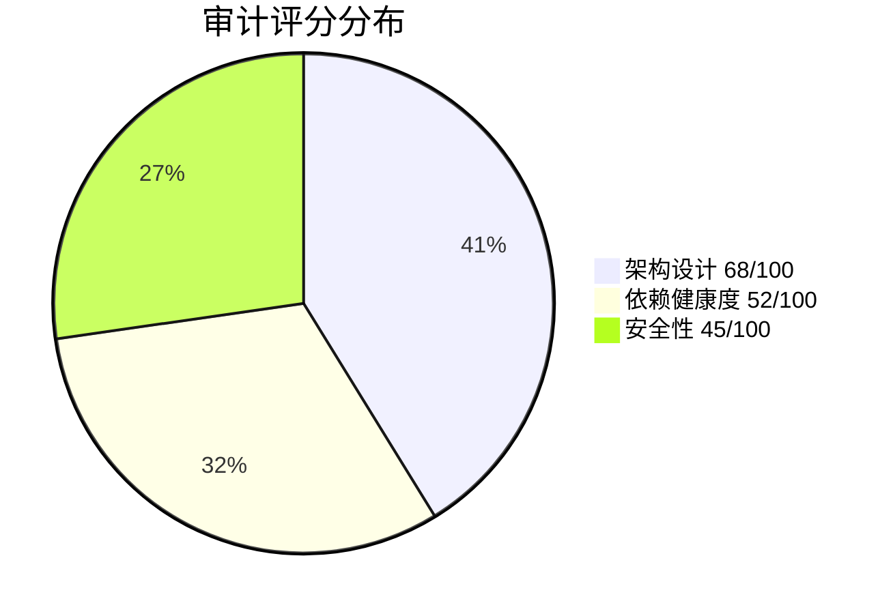
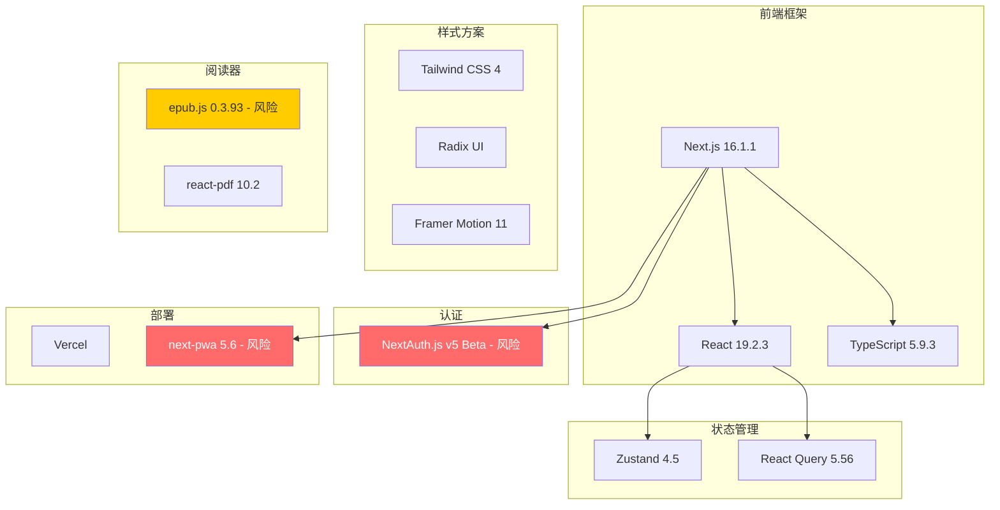
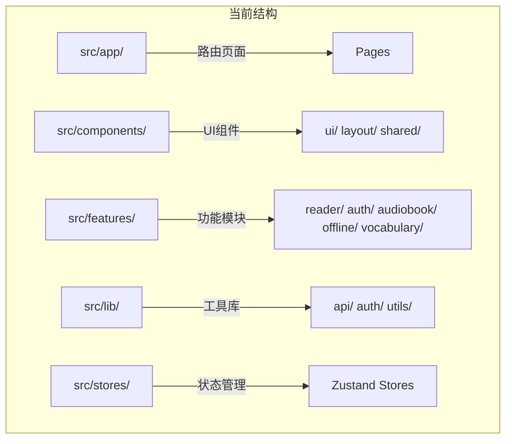
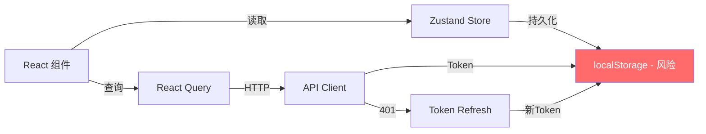
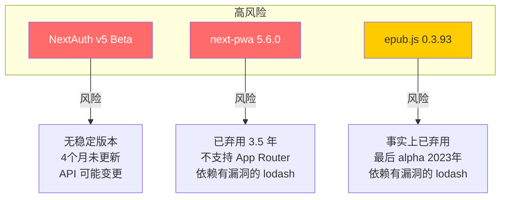
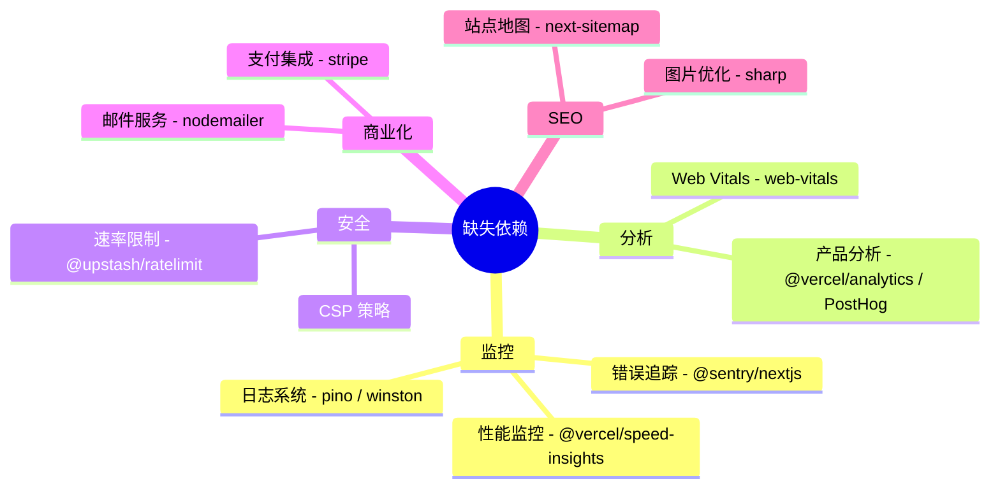
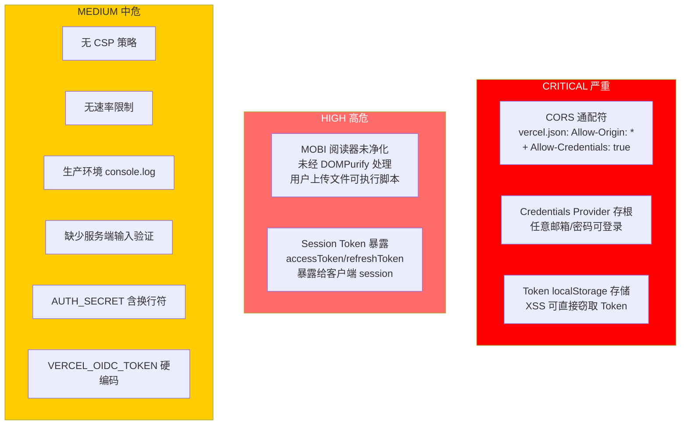
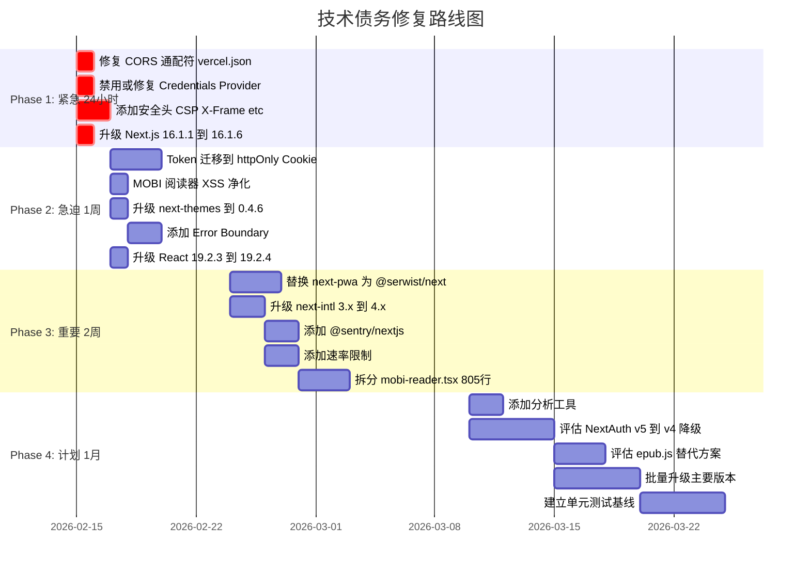
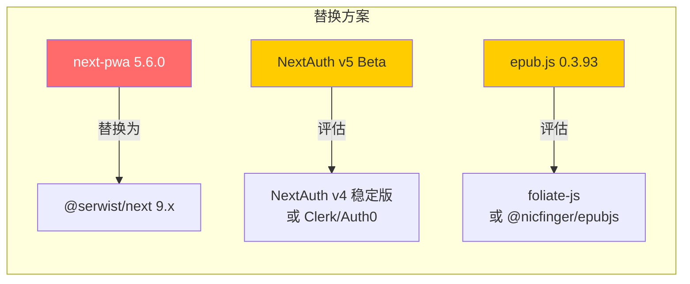

# Readmigo Web 技术架构审计报告

**日期:** 2026-02-14
**审计范围:** 架构设计、依赖健康度、安全性
**综合评分:** 62/100

---

## 评分总览

| 维度 | 评分 | 风险等级 | 说明 |
|------|:----:|:--------:|------|
| 架构设计 | 68/100 | MEDIUM | 结构良好但存在关键缺陷 |
| 依赖健康度 | 52/100 | HIGH | 多个弃用/不兼容依赖 |
| 安全性 | 45/100 | CRITICAL | 3 个严重漏洞需立即修复 |

---

## 一、技术栈评估

### 当前技术栈

### 框架版本状态

| 包名 | 当前版本 | 最新版本 | 状态 |
|------|---------|---------|------|
| Next.js | 16.1.1 | 16.1.6 | **HIGH 漏洞 - 需立即升级** |
| React | 19.2.3 | 19.2.4 | 稳定，一个补丁版本落后 |
| TypeScript | 5.9.3 | 5.9.3 | 最新 |
| Tailwind CSS | 4.1.18 | 4.1.18 | 最新 |

---

## 二、架构设计分析 (68/100)

### 项目结构

### 优点

| 方面 | 评价 |
|------|------|
| 目录结构 | 遵循 Next.js App Router 最佳实践 (app/components/features/lib/stores 分层) |
| 状态管理分层 | Zustand (客户端状态) + React Query (服务端状态) 分离合理 |
| UI 组件库 | Radix UI + shadcn/ui 模式，组件化程度高 |
| 路由组织 | 合理使用路由组 (main)/(auth) 分离布局 |
| TypeScript | 启用了 strict 模式 |

### 严重问题

| 问题 | 影响 | 位置 |
|------|------|------|
| 无错误边界 (Error Boundary) | 任何组件崩溃会导致整个页面白屏 | 全局缺失 |
| 805 行巨型组件 | 可维护性极差，违反单一职责 | mobi-reader.tsx |
| Credentials Provider 存根 | 任意邮箱/密码可登录，生产环境安全隐患 | auth.ts |
| 重复的高亮/书签系统 | 阅读器内有独立实现，stores 里也有，逻辑冲突 | reader/ + stores/ |
| Set 序列化 Bug | Zustand 的 Set 类型在 JSON 序列化时会丢失数据 | stores 中使用 Set |

### 数据流分析

**问题:** Token 存储在 localStorage 而非 httpOnly cookie，XSS 攻击可直接窃取。

---

## 三、依赖健康度分析 (52/100)

### 高风险依赖

### Peer 依赖不匹配

| 包名 | 声明范围 | 实际版本 | 修复方案 |
|------|---------|---------|---------|
| next-themes 0.3.0 | react ^16.8 / ^17 / ^18 | react 19.2.3 | 升级到 0.4.6 |
| next-intl 3.26.5 | next ^10~^15 | next 16.1.1 | 升级到 4.x |

### 漏洞清单

| 严重性 | 包名 | 问题 | 修复 |
|:------:|------|------|------|
| HIGH | next@16.1.1 | HTTP 反序列化 DoS | 升级到 16.1.5+ |
| MODERATE | lodash@4.17.21 (间接) | 原型链污染 | 替换 next-pwa |
| MODERATE | esbuild@0.21.5 (dev) | Dev server 请求伪造 | 升级 vitest 到 v4 |

### 缺失的商业级依赖

### 需要升级的主要版本

| 包名 | 当前 | 最新 | 落后版本数 |
|------|------|------|:----------:|
| @hookform/resolvers | 3.10.0 | 5.2.2 | 2 |
| uuid | 10.0.0 | 13.0.0 | 3 |
| vitest | 2.1.9 | 4.0.18 | 2 |
| zod | 3.25.76 | 4.3.6 | 1 |
| zustand | 4.5.7 | 5.0.11 | 1 |
| recharts | 2.15.4 | 3.7.0 | 1 |
| sonner | 1.7.4 | 2.0.7 | 1 |
| tailwind-merge | 2.6.0 | 3.4.0 | 1 |

---

## 四、安全审计 (风险等级: CRITICAL)

### 漏洞分布

| 严重性 | 数量 | 示例 |
|:------:|:----:|------|
| CRITICAL | 3 | Token localStorage 存储、Credentials 绕过、CORS 通配符 |
| HIGH | 2 | MOBI 阅读器 XSS、Session Token 泄露 |
| MEDIUM | 6 | CSP 缺失、速率限制、控制台日志、依赖漏洞 |
| GOOD | 4 | DOMPurify 使用、.gitignore、Token 刷新、无硬编码密钥 |

### 安全问题详情

### OWASP 合规评估

| 标准 | 状态 | 说明 |
|------|:----:|------|
| OWASP Top 10 2021 | FAIL | A01 访问控制、A02 加密失败、A05 安全配置 |
| CIS Benchmarks | FAIL | 缺少安全头、CORS 配置错误 |
| NIST CSF | PARTIAL | 检测能力不足、防护不完善 |

---

## 五、构建配置分析

### next.config.ts

| 配置项 | 当前值 | 评价 |
|--------|--------|------|
| output | standalone | 适合 Docker/Serverless 部署 |
| turbopack | {} | Next.js 16 默认构建器，正确 |
| serverActions.bodySizeLimit | 2mb | 文件上传合理 |
| 图片远程模式 | 已配置 | 覆盖了所需的图片源 |
| PWA 运行时缓存 | 使用 next-pwa | next-pwa 已弃用，可能与 Turbopack 冲突 |

### tsconfig.json

| 配置项 | 当前值 | 评价 |
|--------|--------|------|
| target | ES2017 | 保守但安全，可升至 ES2020 |
| strict | true | 正确 |
| moduleResolution | bundler | 适合 Turbopack |
| paths @/* | 已配置 | 干净的别名 |

### 引擎约束

| 配置 | 值 | 问题 |
|------|------|------|
| package.json engines.node | 20.x | 本地环境运行 Node 24.x，建议改为 >=20 |

---

## 六、测试策略分析

| 层级 | 工具 | 状态 |
|------|------|:----:|
| 单元测试 | Vitest | 已安装但无测试文件 |
| 组件测试 | @testing-library/react | 已安装但无测试文件 |
| E2E 测试 | Playwright | 11 个测试通过 (本次新建) |
| 类型检查 | TypeScript strict | 启用，但有多处 any |
| Lint | ESLint | 配置存在但有已知错误 |

**结论:** 测试覆盖率极低，仅有 E2E 层的基础测试。

---

## 七、优先级修复路线图

---

## 八、与业界最佳实践对比

### 商业级 Web 应用清单

| 能力 | 当前状态 | 行业标准 | 差距 |
|------|:--------:|:--------:|:----:|
| 错误追踪 (Sentry) | 缺失 | 必须 | 严重 |
| 产品分析 | 缺失 | 必须 | 严重 |
| 性能监控 (RUM) | 缺失 | 推荐 | 中等 |
| 结构化日志 | 缺失 | 必须 | 严重 |
| 速率限制 | 缺失 | 必须 | 严重 |
| CSP 策略 | 缺失 | 必须 | 严重 |
| 错误边界 | 缺失 | 必须 | 严重 |
| 输入验证 (Zod) | 缺失 | 必须 | 中等 |
| A/B 测试 | 缺失 | 推荐 | 低 |
| Feature Flags | 缺失 | 推荐 | 低 |
| CI/CD | GitHub Actions | 达标 | 无 |
| 自动部署 | Vercel | 达标 | 无 |
| TypeScript Strict | 启用 | 达标 | 无 |
| E2E 测试 | 基础 | 达标 | 覆盖低 |
| 单元测试 | 缺失 | 必须 | 严重 |

---

## 九、推荐技术栈调整

### 应替换的依赖

### 应新增的依赖

| 类别 | 推荐包 | 优先级 |
|------|--------|:------:|
| 错误追踪 | @sentry/nextjs | P0 |
| 分析 | @vercel/analytics 或 PostHog | P1 |
| 速率限制 | @upstash/ratelimit | P1 |
| 日志 | pino + next-logger | P1 |
| 性能 | @vercel/speed-insights | P2 |
| 站点地图 | next-sitemap | P2 |
| 图片处理 | sharp | P2 |
| 支付 | stripe + @stripe/stripe-js | P2 |

---

## 十、结论

### 优势

- 技术选型方向正确 (Next.js + React + TypeScript + Tailwind)
- Zustand + React Query 的状态管理分层合理
- 组件化程度较高，UI 组件库选择得当
- Vercel 部署管道已就绪

### 关键风险

1. **安全漏洞** - 3 个 CRITICAL 级别问题必须在上线前修复
2. **弃用依赖** - next-pwa 已完全弃用，epub.js 事实弃用
3. **Beta 依赖** - NextAuth v5 无稳定版本承诺
4. **监控空白** - 无错误追踪、无日志、无分析，生产环境等于盲飞
5. **测试不足** - 无单元测试，仅 11 个 E2E 测试

### 总体评价

> 当前技术架构的**方向是正确的**，但**成熟度不足以支撑商业级应用**。主要差距集中在安全性、可观测性和依赖稳定性三个方面。建议按照上述路线图逐步修复，在 Phase 1-2 完成后可认为达到基本的生产就绪标准。
